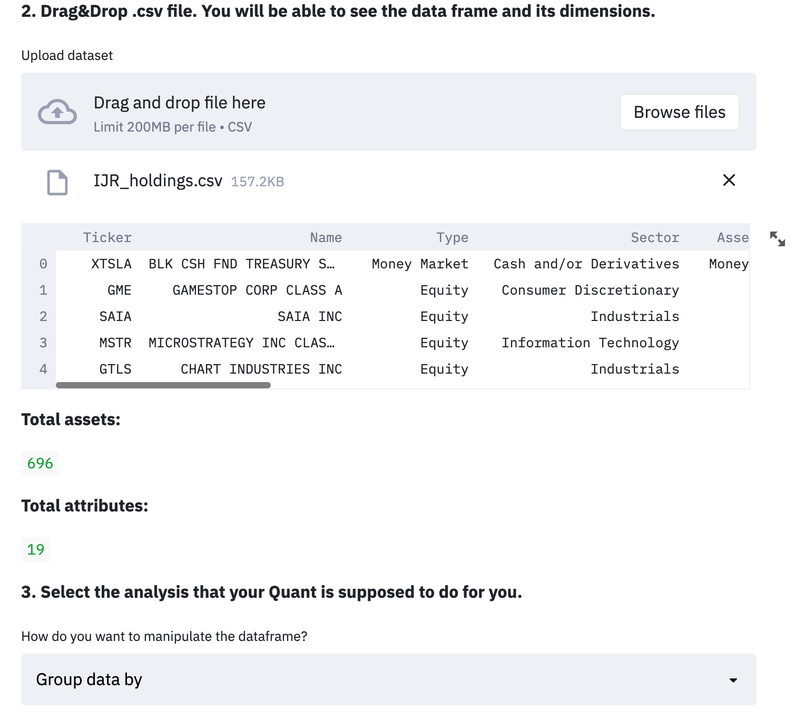
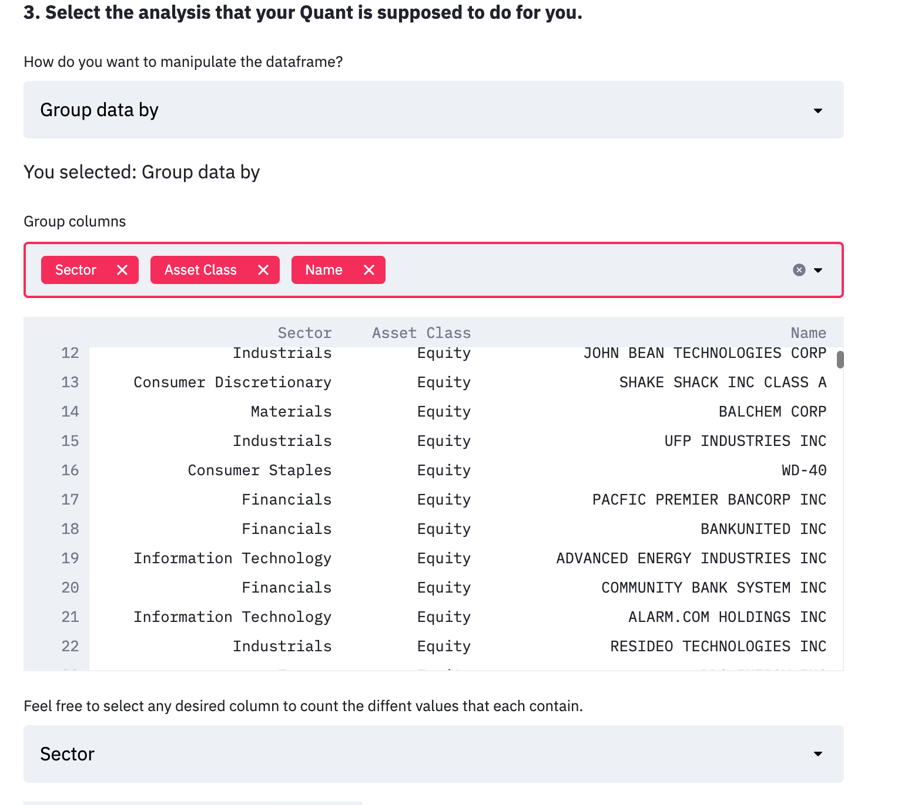
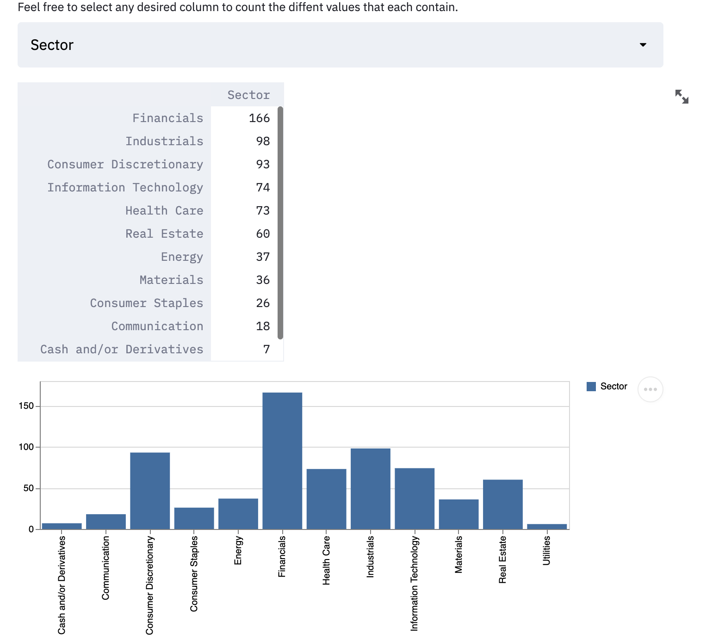
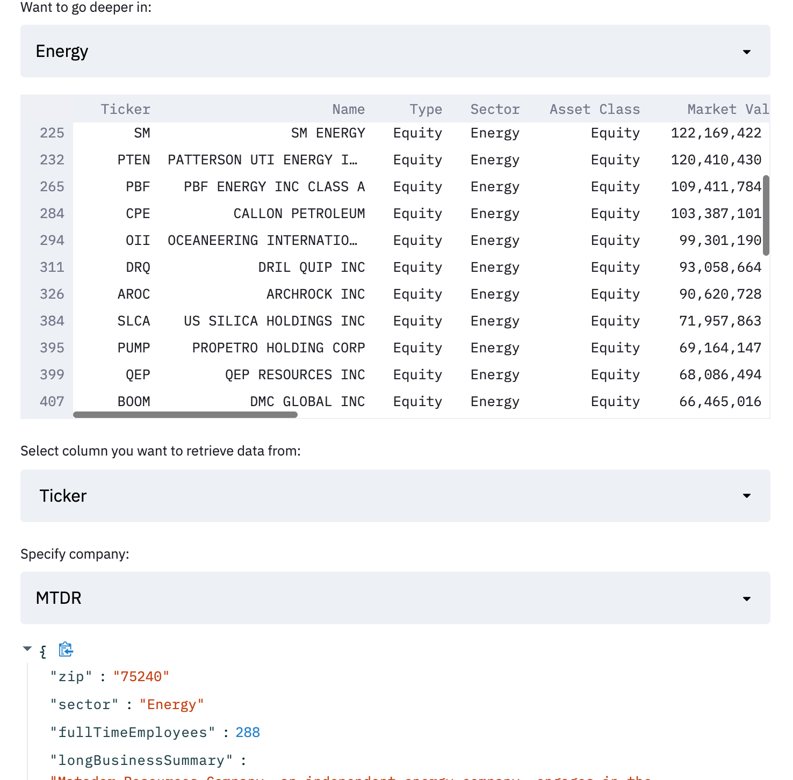
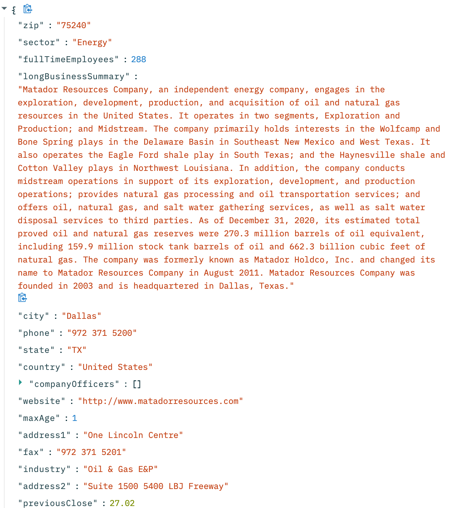

  # Using

        1. Create the dependency environment based on file *environment.yml* using Conda.
        2. Run: streamlit run first_app.py 
        3. App should appear in your local host. 
        4. Download the ETF/Fund csv and drag and drop it in the app. (Follow instructions).

 ## Pics
 
 
 
 
 

##### Last updated: 06/05/2021